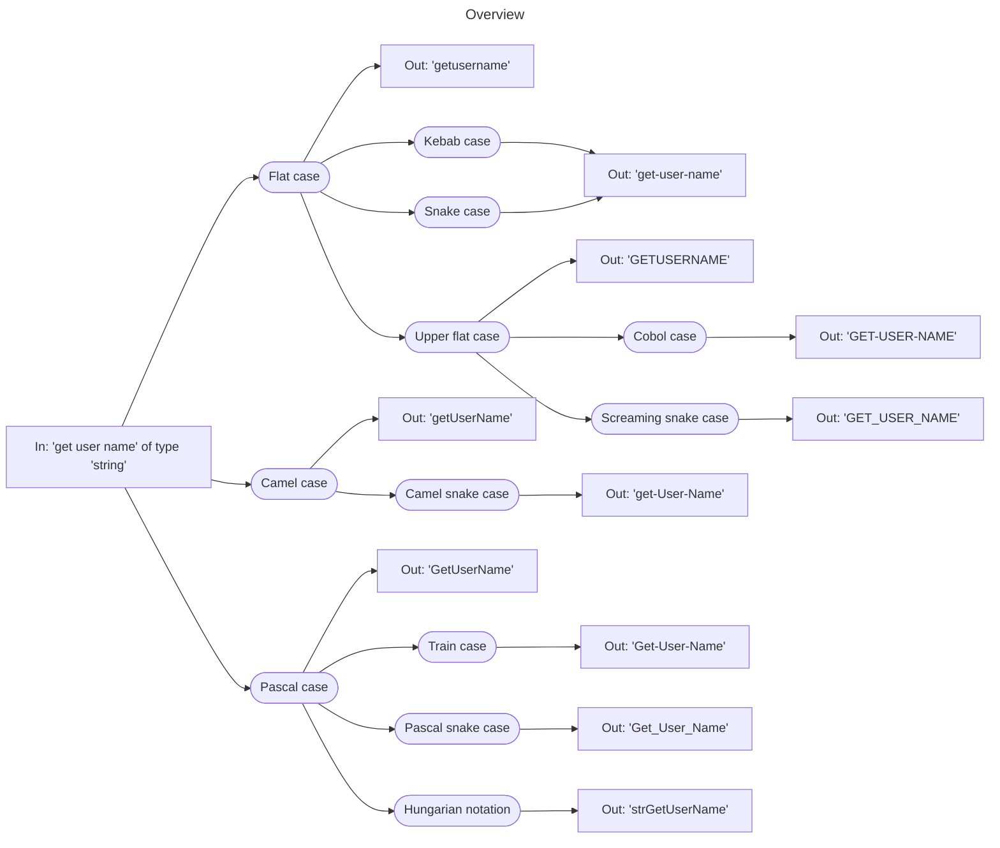

# Naming conventions

Example strings

| String          | Type     |
| --------------- | -------- |
| `get user name` | `string` |
| `is logged in`  | `bool`   |
| `pi value`      | `string` |

Overview

## Flat case

- `getusername`
- `isloggedin`
- `pivalue`

Process:

1. Remove all special characters
2. Lowercase the first letter of each word
3. Replace all spaces

## Kebab case

Like the [flat case](#flat-case), but with hyphens `-` as a separator

- `get-user-name`
- `is-logged-in`
- `pi-value`

Process:

1. Remove all special characters
2. Lowercase the first letter of each word
3. Replace all spaces with hyphens &rarr; `-`

## Snake case

Same like [kebab case](#kebab-case)

## Upper flat case

Like the [flat case](#flat-case), but with capitalized letters

- `GETUSERNAME`
- `ISLOGGEDIN`
- `PIVALUE`

Process:

1. Remove all special characters
2. Capitalize all letters of each word
3. Replace all spaces

## Cobol case

Like the [upper flat case](#upper-flat-case), but with hyphen `-` as a separator

- `GET-USER-NAME`
- `IS-LOGGED-IN`
- `PI-VALUE`

Process:

1. Remove all special characters
2. Capitalize all letters of each word
3. Replace all spaces with hyphens &rarr; `-`

## Screaming snake case

Like the [upper flat case](#upper-flat-case), but with underscore `_` as a separator

- `GET_USER_NAME`
- `IS_LOGGED_IN`
- `PI_VALUE`

Process:

1. Remove all special characters
2. Capitalize all letters of each word
3. Replace all spaces with underscores &rarr; `_`

## Camel case

- `getUser​Name`
- `isLoggedIn`
- `piValue`

Process:

1. Remove all special characters
2. Capitalize the first letter of each word, except the first word
3. Remove all spaces

## Camel snake case

Like the [camel case](#camel-case), but with hyphen `-` as a separator

- `get-User-​Name`
- `is-Logged-In`
- `pi-Value`

Process:

1. Remove all special characters
2. Capitalize the first letter of each word, except the first word
3. Replace all spaces with hyphens &rarr; `-`

## Pascal case

Like the [camel case](#camel-case), but with capitalized letters for each word

- `GetUser​Name`
- `IsLoggedIn`
- `PiValue`

Process:

1. Remove all special characters
2. Capitalize the first letter of each word
3. Remove all spaces

## Train case

Like the [pascal case](#pascal-case), but with hyphen `-` as a separator

- `Get-User​-Name`
- `Is-Logged-In`
- `Pi-Value`

Process:

1. Remove all special characters
2. Capitalize the first letter of each word
3. Replace all spaces with hyphens &rarr; `-`

## Pascal snake case

Like the [pascal case](#pascal-case), but with underscore `_` as a separator

- `Get_User​_Name`
- `Is_Logged_In`
- `Pi_Value`

Process:

1. Remove all special characters
2. Capitalize the first letter of each word
3. Replace all spaces with underscores &rarr; `_`

## Hungarian notation

Like the [pascal case](#pascal-case), but with additional prefix for data type

- `strGetUserName`
- `xIsLoggedIn`
- `strPiValue`

Process:

1. Remove all special characters
2. Capitalize the first letter of each word
3. Remove all spaces
4. Add prefix with datatype
